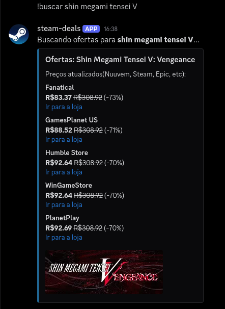
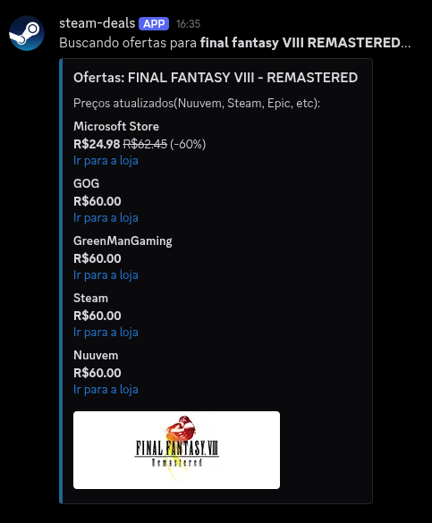

# Steam Deals Bot

Um bot para Discord desenvolvido em Python que busca os menores preços de jogos em lojas oficiais (Steam, Nuuvem, Epic Games, GOG) com valores regionalizados nativamente em Reais (BRL).

## Funcionalidades

* **Preços Regionais Exatos:** Utiliza a API v3 do *IsThereAnyDeal* para buscar ofertas no Brasil, dispensando cálculos imprecisos de conversão de dólar e focando na regionalização.
* **Cobertura Ampla:** Rastreia as principais lojas oficiais que operam no país.

 

## Como Adicionar ao Seu Servidor

Para adicionar o Bot no seu servidor, basta clicar no link abaixo e escolher o servidor em que deseja colocar ele:

**[Adicionar Bot](https://discord.com/oauth2/authorize?client_id=1550010016600293386&permissions=18432&integration_type=0&scope=bot)**

*(Nota: Você precisa ter a permissão "Gerenciar Servidor" no servidor em que deseja adiciona-lo)*

## Comandos
O bot tem uma funcionalidade e é extremamente simples de usar. Digite no chat:
* `!buscar [nome do jogo]` - O bot vai pesquisar o jogo e retornar uma lista com as 5 melhores ofertas do momento, com link direto para a loja.
  * *Exemplo:* `!buscar Hollow Knight`

* `!ping` - verifica se o bot ta online e respondendo.

## Instalação e Configuração Local

Para hospedar o bot por conta própria (localmente ou no Render), você precisará configurar suas variáveis de ambiente. Crie um arquivo `.env` na raiz do projeto contendo:

```env
DISCORD_TOKEN=seu_token_do_discord_aqui
ITAD_API_KEY=sua_chave_do_isthereanydeal_aqui
USER_EMAIL=seu_email@exemplo.com
```
e rode o .py
